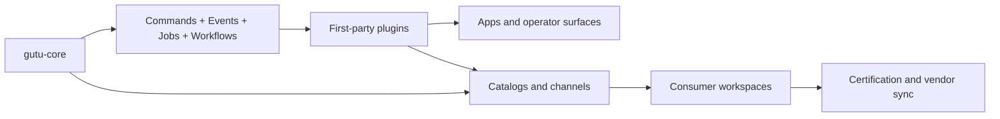

# gutu-plugins

  

Catalog repository for first-party Gutu plugins.

This catalog is a **truth-first index** for the extracted plugin ecosystem. The badges and maturity labels referenced here are local-status documentation badges backed by repo facts, not live npm or GitHub Actions badges.

## Live Catalog Surface

- `catalog/index.json` tracks the full first-party plugin inventory.
- `channels/stable.json` and `channels/next.json` are the installable release channels used by `gutu vendor sync`.
- Promoted `stable` channel entries point at signed GitHub Release assets and are validated in CI before merge.
- Unreleased or unpromoted plugins stay on `next` even when the repo is mature, so the catalog never claims a stable install path without a verified artifact.

## What Gutu Solves

| Platform Problem | Typical Failure Mode | Gutu Response |
| --- | --- | --- |
| Plugin sprawl without governance | Teams ship hidden dependencies, magical integration points, and stale docs. | Each plugin carries a manifest, explicit capability requests, and repo-local verification. |
| Hook-heavy extension models | Side effects become hard to trace, test, or replay safely. | Gutu prefers commands, resources, durable events, jobs, and workflows over generic hook buses. |
| Monorepo-only internal platforms | Independent release cadence and ownership boundaries stay fuzzy. | Plugins are shaped as standalone repos with focused docs, CI surfaces, and compatibility metadata. |

## Ecosystem Shape

## Maturity Matrix

| Plugin | Domain Group | Default Category | Maturity | Verification | DB | Integration | Docs |
| --- | --- | --- | --- | --- | --- | --- | --- |
| [Admin Shell Workbench](https://github.com/gutula/gutu-plugin-admin-shell-workbench) | Platform Backbone | Platform Governance / Admin Shell | `Baseline` | Build+Typecheck+Lint+Test+Contracts | postgres + sqlite | Actions+Resources+UI | [README](https://github.com/gutula/gutu-plugin-admin-shell-workbench#readme) · [DEVELOPER](https://github.com/gutula/gutu-plugin-admin-shell-workbench/blob/main/DEVELOPER.md) |
| [Audit Core](https://github.com/gutula/gutu-plugin-audit-core) | Platform Backbone | Platform Governance / Audit & Compliance | `Baseline` | Build+Typecheck+Lint+Test+Contracts | postgres + sqlite | Actions+Resources+UI | [README](https://github.com/gutula/gutu-plugin-audit-core#readme) · [DEVELOPER](https://github.com/gutula/gutu-plugin-audit-core/blob/main/DEVELOPER.md) |
| [Auth Core](https://github.com/gutula/gutu-plugin-auth-core) | Platform Backbone | User Management / Authentication | `Baseline` | Build+Typecheck+Lint+Test+Contracts | postgres + sqlite | Actions+Resources+UI | [README](https://github.com/gutula/gutu-plugin-auth-core#readme) · [DEVELOPER](https://github.com/gutula/gutu-plugin-auth-core/blob/main/DEVELOPER.md) |
| [Automation Core](https://github.com/gutula/gutu-plugin-automation-core) | Platform Backbone | Platform Governance / Automation | `Hardened` | Build+Typecheck+Lint+Test+Contracts+Migrations+Integration | postgres + sqlite | Actions+Resources+Jobs+UI | [README](https://github.com/gutula/gutu-plugin-automation-core#readme) · [DEVELOPER](https://github.com/gutula/gutu-plugin-automation-core/blob/main/DEVELOPER.md) |
| [Jobs Core](https://github.com/gutula/gutu-plugin-jobs-core) | Platform Backbone | Platform Governance / Job Orchestration | `Hardened` | Build+Typecheck+Lint+Test+Contracts | postgres + sqlite | Actions+Resources+Jobs+UI | [README](https://github.com/gutula/gutu-plugin-jobs-core#readme) · [DEVELOPER](https://github.com/gutula/gutu-plugin-jobs-core/blob/main/DEVELOPER.md) |
| [Org Tenant Core](https://github.com/gutula/gutu-plugin-org-tenant-core) | Platform Backbone | User Management / Organizations & Tenants | `Baseline` | Build+Typecheck+Lint+Test+Contracts | postgres + sqlite | Actions+Resources+UI | [README](https://github.com/gutula/gutu-plugin-org-tenant-core#readme) · [DEVELOPER](https://github.com/gutula/gutu-plugin-org-tenant-core/blob/main/DEVELOPER.md) |
| [Role Policy Core](https://github.com/gutula/gutu-plugin-role-policy-core) | Platform Backbone | User Management / Roles & Permissions | `Baseline` | Build+Typecheck+Lint+Test+Contracts | postgres + sqlite | Actions+Resources+UI | [README](https://github.com/gutula/gutu-plugin-role-policy-core#readme) · [DEVELOPER](https://github.com/gutula/gutu-plugin-role-policy-core/blob/main/DEVELOPER.md) |
| [Workflow Core](https://github.com/gutula/gutu-plugin-workflow-core) | Platform Backbone | Platform Governance / Workflow & Approvals | `Hardened` | Build+Typecheck+Lint+Test+Contracts | postgres + sqlite | Actions+Resources+Workflows+UI | [README](https://github.com/gutula/gutu-plugin-workflow-core#readme) · [DEVELOPER](https://github.com/gutula/gutu-plugin-workflow-core/blob/main/DEVELOPER.md) |
| [Accounting Core](https://github.com/gutula/gutu-plugin-accounting-core) | Operational Data | Business / Accounting & Finance | `Hardened` | Build+Typecheck+Lint+Test+Contracts+Migrations+Integration | postgres + sqlite | Actions+Resources+Jobs+Workflows+UI | [README](https://github.com/gutula/gutu-plugin-accounting-core#readme) · [DEVELOPER](https://github.com/gutula/gutu-plugin-accounting-core/blob/main/DEVELOPER.md) |
| [Analytics & BI Core](https://github.com/gutula/gutu-plugin-analytics-bi-core) | Operational Data | Business / Analytics & Reporting | `Hardened` | Build+Typecheck+Lint+Test+Contracts+Migrations+Integration | postgres + sqlite | Actions+Resources+Jobs+Workflows+UI | [README](https://github.com/gutula/gutu-plugin-analytics-bi-core#readme) · [DEVELOPER](https://github.com/gutula/gutu-plugin-analytics-bi-core/blob/main/DEVELOPER.md) |
| [Assets Core](https://github.com/gutula/gutu-plugin-assets-core) | Operational Data | Business / Assets & Lifecycle | `Hardened` | Build+Typecheck+Lint+Test+Contracts+Migrations+Integration | postgres + sqlite | Actions+Resources+Jobs+Workflows+UI | [README](https://github.com/gutula/gutu-plugin-assets-core#readme) · [DEVELOPER](https://github.com/gutula/gutu-plugin-assets-core/blob/main/DEVELOPER.md) |
| [Booking Core](https://github.com/gutula/gutu-plugin-booking-core) | Operational Data | Business / Booking & Reservations | `Hardened` | Build+Typecheck+Lint+Test+Contracts+Migrations | postgres + sqlite | Actions+Resources+UI | [README](https://github.com/gutula/gutu-plugin-booking-core#readme) · [DEVELOPER](https://github.com/gutula/gutu-plugin-booking-core/blob/main/DEVELOPER.md) |
| [Contracts Core](https://github.com/gutula/gutu-plugin-contracts-core) | Operational Data | Business / Sales & Commerce | `Hardened` | Build+Typecheck+Lint+Test+Contracts+Migrations+Integration | postgres + sqlite | Actions+Resources+Jobs+Workflows+UI | [README](https://github.com/gutula/gutu-plugin-contracts-core#readme) · [DEVELOPER](https://github.com/gutula/gutu-plugin-contracts-core/blob/main/DEVELOPER.md) |
| [CRM Core](https://github.com/gutula/gutu-plugin-crm-core) | Operational Data | Business / CRM & Pipeline | `Hardened` | Build+Typecheck+Lint+Test+Contracts+Migrations+Integration | postgres + sqlite | Actions+Resources+Jobs+Workflows+UI | [README](https://github.com/gutula/gutu-plugin-crm-core#readme) · [DEVELOPER](https://github.com/gutula/gutu-plugin-crm-core/blob/main/DEVELOPER.md) |
| [Dashboard Core](https://github.com/gutula/gutu-plugin-dashboard-core) | Operational Data | Business / Analytics & Reporting | `Baseline` | Build+Typecheck+Lint+Test+Contracts | postgres + sqlite | Actions+Resources+UI | [README](https://github.com/gutula/gutu-plugin-dashboard-core#readme) · [DEVELOPER](https://github.com/gutula/gutu-plugin-dashboard-core/blob/main/DEVELOPER.md) |
| [E-Invoicing Core](https://github.com/gutula/gutu-plugin-e-invoicing-core) | Operational Data | Business / Accounting & Finance | `Hardened` | Build+Typecheck+Lint+Test+Contracts+Migrations+Integration | postgres + sqlite | Actions+Resources+Jobs+Workflows+UI | [README](https://github.com/gutula/gutu-plugin-e-invoicing-core#readme) · [DEVELOPER](https://github.com/gutula/gutu-plugin-e-invoicing-core/blob/main/DEVELOPER.md) |
| [Field Service Core](https://github.com/gutula/gutu-plugin-field-service-core) | Operational Data | Business / Support & Service | `Hardened` | Build+Typecheck+Lint+Test+Contracts+Migrations+Integration | postgres + sqlite | Actions+Resources+Jobs+Workflows+UI | [README](https://github.com/gutula/gutu-plugin-field-service-core#readme) · [DEVELOPER](https://github.com/gutula/gutu-plugin-field-service-core/blob/main/DEVELOPER.md) |
| [HR & Payroll Core](https://github.com/gutula/gutu-plugin-hr-payroll-core) | Operational Data | Business / HR & Payroll | `Hardened` | Build+Typecheck+Lint+Test+Contracts+Migrations+Integration | postgres + sqlite | Actions+Resources+Jobs+Workflows+UI | [README](https://github.com/gutula/gutu-plugin-hr-payroll-core#readme) · [DEVELOPER](https://github.com/gutula/gutu-plugin-hr-payroll-core/blob/main/DEVELOPER.md) |
| [Inventory Core](https://github.com/gutula/gutu-plugin-inventory-core) | Operational Data | Business / Inventory & Warehouse | `Hardened` | Build+Typecheck+Lint+Test+Contracts+Migrations+Integration | postgres + sqlite | Actions+Resources+Jobs+Workflows+UI | [README](https://github.com/gutula/gutu-plugin-inventory-core#readme) · [DEVELOPER](https://github.com/gutula/gutu-plugin-inventory-core/blob/main/DEVELOPER.md) |
| [Maintenance & CMMS Core](https://github.com/gutula/gutu-plugin-maintenance-cmms-core) | Operational Data | Business / Assets & Lifecycle | `Hardened` | Build+Typecheck+Lint+Test+Contracts+Migrations+Integration | postgres + sqlite | Actions+Resources+Jobs+Workflows+UI | [README](https://github.com/gutula/gutu-plugin-maintenance-cmms-core#readme) · [DEVELOPER](https://github.com/gutula/gutu-plugin-maintenance-cmms-core/blob/main/DEVELOPER.md) |
| [Manufacturing Core](https://github.com/gutula/gutu-plugin-manufacturing-core) | Operational Data | Business / Manufacturing & Production | `Hardened` | Build+Typecheck+Lint+Test+Contracts+Migrations+Integration | postgres + sqlite | Actions+Resources+Jobs+Workflows+UI | [README](https://github.com/gutula/gutu-plugin-manufacturing-core#readme) · [DEVELOPER](https://github.com/gutula/gutu-plugin-manufacturing-core/blob/main/DEVELOPER.md) |
| [Notifications Core](https://github.com/gutula/gutu-plugin-notifications-core) | Operational Data | Business / Communications | `Production Candidate` | Build+Typecheck+Lint+Test+Contracts+Migrations+Integration | postgres + sqlite | Actions+Resources+Events+Jobs+UI | [README](https://github.com/gutula/gutu-plugin-notifications-core#readme) · [DEVELOPER](https://github.com/gutula/gutu-plugin-notifications-core/blob/main/DEVELOPER.md) |
| [Page Builder Core](https://github.com/gutula/gutu-plugin-page-builder-core) | Operational Data | Content & Experience / Page Building | `Baseline` | Build+Typecheck+Lint+Test+Contracts | postgres + sqlite | Actions+Resources+UI | [README](https://github.com/gutula/gutu-plugin-page-builder-core#readme) · [DEVELOPER](https://github.com/gutula/gutu-plugin-page-builder-core/blob/main/DEVELOPER.md) |
| [Party & Relationships Core](https://github.com/gutula/gutu-plugin-party-relationships-core) | Operational Data | Business / Party & Relationships | `Hardened` | Build+Typecheck+Lint+Test+Contracts+Migrations+Integration | postgres + sqlite | Actions+Resources+Jobs+Workflows+UI | [README](https://github.com/gutula/gutu-plugin-party-relationships-core#readme) · [DEVELOPER](https://github.com/gutula/gutu-plugin-party-relationships-core/blob/main/DEVELOPER.md) |
| [Payments Core](https://github.com/gutula/gutu-plugin-payments-core) | Operational Data | Business / Payments | `Hardened` | Build+Typecheck+Lint+Test+Contracts+Migrations+Integration | postgres + sqlite | Actions+Resources+Jobs+UI | [README](https://github.com/gutula/gutu-plugin-payments-core#readme) · [DEVELOPER](https://github.com/gutula/gutu-plugin-payments-core/blob/main/DEVELOPER.md) |
| [Portal Core](https://github.com/gutula/gutu-plugin-portal-core) | Operational Data | Content & Experience / Portal Experience | `Baseline` | Build+Typecheck+Lint+Test+Contracts | postgres + sqlite | Actions+Resources+UI | [README](https://github.com/gutula/gutu-plugin-portal-core#readme) · [DEVELOPER](https://github.com/gutula/gutu-plugin-portal-core/blob/main/DEVELOPER.md) |
| [POS Core](https://github.com/gutula/gutu-plugin-pos-core) | Operational Data | Business / POS & Retail | `Hardened` | Build+Typecheck+Lint+Test+Contracts+Migrations+Integration | postgres + sqlite | Actions+Resources+Jobs+Workflows+UI | [README](https://github.com/gutula/gutu-plugin-pos-core#readme) · [DEVELOPER](https://github.com/gutula/gutu-plugin-pos-core/blob/main/DEVELOPER.md) |
| [Pricing & Tax Core](https://github.com/gutula/gutu-plugin-pricing-tax-core) | Operational Data | Business / Pricing & Tax | `Hardened` | Build+Typecheck+Lint+Test+Contracts+Migrations+Integration | postgres + sqlite | Actions+Resources+Jobs+Workflows+UI | [README](https://github.com/gutula/gutu-plugin-pricing-tax-core#readme) · [DEVELOPER](https://github.com/gutula/gutu-plugin-pricing-tax-core/blob/main/DEVELOPER.md) |
| [Procurement Core](https://github.com/gutula/gutu-plugin-procurement-core) | Operational Data | Business / Procurement & Sourcing | `Hardened` | Build+Typecheck+Lint+Test+Contracts+Migrations+Integration | postgres + sqlite | Actions+Resources+Jobs+Workflows+UI | [README](https://github.com/gutula/gutu-plugin-procurement-core#readme) · [DEVELOPER](https://github.com/gutula/gutu-plugin-procurement-core/blob/main/DEVELOPER.md) |
| [Product & Catalog Core](https://github.com/gutula/gutu-plugin-product-catalog-core) | Operational Data | Business / Product & Catalog | `Hardened` | Build+Typecheck+Lint+Test+Contracts+Migrations+Integration | postgres + sqlite | Actions+Resources+Jobs+Workflows+UI | [README](https://github.com/gutula/gutu-plugin-product-catalog-core#readme) · [DEVELOPER](https://github.com/gutula/gutu-plugin-product-catalog-core/blob/main/DEVELOPER.md) |
| [Projects Core](https://github.com/gutula/gutu-plugin-projects-core) | Operational Data | Business / Projects & Delivery | `Hardened` | Build+Typecheck+Lint+Test+Contracts+Migrations+Integration | postgres + sqlite | Actions+Resources+Jobs+Workflows+UI | [README](https://github.com/gutula/gutu-plugin-projects-core#readme) · [DEVELOPER](https://github.com/gutula/gutu-plugin-projects-core/blob/main/DEVELOPER.md) |
| [Quality Core](https://github.com/gutula/gutu-plugin-quality-core) | Operational Data | Business / Quality & Compliance | `Hardened` | Build+Typecheck+Lint+Test+Contracts+Migrations+Integration | postgres + sqlite | Actions+Resources+Jobs+Workflows+UI | [README](https://github.com/gutula/gutu-plugin-quality-core#readme) · [DEVELOPER](https://github.com/gutula/gutu-plugin-quality-core/blob/main/DEVELOPER.md) |
| [Sales Core](https://github.com/gutula/gutu-plugin-sales-core) | Operational Data | Business / Sales & Commerce | `Hardened` | Build+Typecheck+Lint+Test+Contracts+Migrations+Integration | postgres + sqlite | Actions+Resources+Jobs+Workflows+UI | [README](https://github.com/gutula/gutu-plugin-sales-core#readme) · [DEVELOPER](https://github.com/gutula/gutu-plugin-sales-core/blob/main/DEVELOPER.md) |
| [Search Core](https://github.com/gutula/gutu-plugin-search-core) | Operational Data | Content & Experience / Search & Discovery | `Baseline` | Build+Typecheck+Lint+Test+Contracts | postgres + sqlite | Actions+Resources+UI | [README](https://github.com/gutula/gutu-plugin-search-core#readme) · [DEVELOPER](https://github.com/gutula/gutu-plugin-search-core/blob/main/DEVELOPER.md) |
| [Subscriptions Core](https://github.com/gutula/gutu-plugin-subscriptions-core) | Operational Data | Business / Sales & Commerce | `Hardened` | Build+Typecheck+Lint+Test+Contracts+Migrations+Integration | postgres + sqlite | Actions+Resources+Jobs+Workflows+UI | [README](https://github.com/gutula/gutu-plugin-subscriptions-core#readme) · [DEVELOPER](https://github.com/gutula/gutu-plugin-subscriptions-core/blob/main/DEVELOPER.md) |
| [Support & Service Core](https://github.com/gutula/gutu-plugin-support-service-core) | Operational Data | Business / Support & Service | `Hardened` | Build+Typecheck+Lint+Test+Contracts+Migrations+Integration | postgres + sqlite | Actions+Resources+Jobs+Workflows+UI | [README](https://github.com/gutula/gutu-plugin-support-service-core#readme) · [DEVELOPER](https://github.com/gutula/gutu-plugin-support-service-core/blob/main/DEVELOPER.md) |
| [Traceability & Dimensions Core](https://github.com/gutula/gutu-plugin-traceability-core) | Operational Data | Business / Traceability & Dimensions | `Hardened` | Build+Typecheck+Lint+Test+Contracts+Migrations+Integration | postgres + sqlite | Actions+Resources+Jobs+Workflows+UI | [README](https://github.com/gutula/gutu-plugin-traceability-core#readme) · [DEVELOPER](https://github.com/gutula/gutu-plugin-traceability-core/blob/main/DEVELOPER.md) |
| [Treasury Core](https://github.com/gutula/gutu-plugin-treasury-core) | Operational Data | Business / Accounting & Finance | `Hardened` | Build+Typecheck+Lint+Test+Contracts+Migrations+Integration | postgres + sqlite | Actions+Resources+Jobs+Workflows+UI | [README](https://github.com/gutula/gutu-plugin-treasury-core#readme) · [DEVELOPER](https://github.com/gutula/gutu-plugin-treasury-core/blob/main/DEVELOPER.md) |
| [User Directory](https://github.com/gutula/gutu-plugin-user-directory) | Operational Data | User Management / Directory & Profiles | `Baseline` | Build+Typecheck+Lint+Test+Contracts | postgres + sqlite | Actions+Resources+UI | [README](https://github.com/gutula/gutu-plugin-user-directory#readme) · [DEVELOPER](https://github.com/gutula/gutu-plugin-user-directory/blob/main/DEVELOPER.md) |
| [AI Assist Core](https://github.com/gutula/gutu-plugin-ai-assist-core) | AI Systems | AI & Automation / Operating Models | `Hardened` | Build+Typecheck+Lint+Test+Contracts+Migrations+Integration | postgres + sqlite | Actions+Resources+Jobs+Workflows+UI | [README](https://github.com/gutula/gutu-plugin-ai-assist-core#readme) · [DEVELOPER](https://github.com/gutula/gutu-plugin-ai-assist-core/blob/main/DEVELOPER.md) |
| [AI Core](https://github.com/gutula/gutu-plugin-ai-core) | AI Systems | AI & Automation / Agent Runtime | `Hardened` | Build+Typecheck+Lint+Test+Contracts+Migrations+Integration | postgres + sqlite | Actions+Resources+Events+Jobs+Workflows+UI | [README](https://github.com/gutula/gutu-plugin-ai-core#readme) · [DEVELOPER](https://github.com/gutula/gutu-plugin-ai-core/blob/main/DEVELOPER.md) |
| [AI Evals](https://github.com/gutula/gutu-plugin-ai-evals) | AI Systems | AI & Automation / Evaluation & Governance | `Hardened` | Build+Typecheck+Lint+Test+Contracts+Migrations+Integration | postgres + sqlite | Actions+Resources+Jobs+UI | [README](https://github.com/gutula/gutu-plugin-ai-evals#readme) · [DEVELOPER](https://github.com/gutula/gutu-plugin-ai-evals/blob/main/DEVELOPER.md) |
| [AI RAG](https://github.com/gutula/gutu-plugin-ai-rag) | AI Systems | AI & Automation / Retrieval & Knowledge | `Hardened` | Build+Typecheck+Lint+Test+Contracts+Migrations+Integration | postgres + sqlite | Actions+Resources+Jobs+UI | [README](https://github.com/gutula/gutu-plugin-ai-rag#readme) · [DEVELOPER](https://github.com/gutula/gutu-plugin-ai-rag/blob/main/DEVELOPER.md) |
| [AI Skills Core](https://github.com/gutula/gutu-plugin-ai-skills-core) | AI Systems | AI & Automation / Skills & Profiles | `Hardened` | Build+Typecheck+Lint+Test+Contracts+Migrations+Integration | postgres + sqlite | Actions+Resources+UI | [README](https://github.com/gutula/gutu-plugin-ai-skills-core#readme) · [DEVELOPER](https://github.com/gutula/gutu-plugin-ai-skills-core/blob/main/DEVELOPER.md) |
| [Execution Workspaces Core](https://github.com/gutula/gutu-plugin-execution-workspaces-core) | AI Systems | AI & Automation / Execution Workspaces | `Hardened` | Build+Typecheck+Lint+Test+Contracts+Migrations+Integration | postgres + sqlite | Actions+Resources+UI | [README](https://github.com/gutula/gutu-plugin-execution-workspaces-core#readme) · [DEVELOPER](https://github.com/gutula/gutu-plugin-execution-workspaces-core/blob/main/DEVELOPER.md) |
| [Integration Core](https://github.com/gutula/gutu-plugin-integration-core) | AI Systems | Integrations / Connectors & Webhooks | `Hardened` | Build+Typecheck+Lint+Test+Contracts+Migrations+Integration | postgres + sqlite | Actions+Resources+UI | [README](https://github.com/gutula/gutu-plugin-integration-core#readme) · [DEVELOPER](https://github.com/gutula/gutu-plugin-integration-core/blob/main/DEVELOPER.md) |
| [Issues Core](https://github.com/gutula/gutu-plugin-issues-core) | AI Systems | Business / Work Management | `Hardened` | Build+Typecheck+Lint+Test+Contracts+Migrations+Integration | postgres + sqlite | Actions+Resources+UI | [README](https://github.com/gutula/gutu-plugin-issues-core#readme) · [DEVELOPER](https://github.com/gutula/gutu-plugin-issues-core/blob/main/DEVELOPER.md) |
| [Runtime Bridge Core](https://github.com/gutula/gutu-plugin-runtime-bridge-core) | AI Systems | AI & Automation / Runtime Bridges | `Hardened` | Build+Typecheck+Lint+Test+Contracts+Migrations+Integration | postgres + sqlite | Actions+Resources+UI | [README](https://github.com/gutula/gutu-plugin-runtime-bridge-core#readme) · [DEVELOPER](https://github.com/gutula/gutu-plugin-runtime-bridge-core/blob/main/DEVELOPER.md) |
| [Company Builder Core](https://github.com/gutula/gutu-plugin-company-builder-core) | Governed AI Operating Models | AI & Automation / Operating Models | `Hardened` | Build+Typecheck+Lint+Test+Contracts+Migrations+Integration | postgres + sqlite | Actions+Resources+Jobs+UI | [README](https://github.com/gutula/gutu-plugin-company-builder-core#readme) · [DEVELOPER](https://github.com/gutula/gutu-plugin-company-builder-core/blob/main/DEVELOPER.md) |
| [Business Portals Core](https://github.com/gutula/gutu-plugin-business-portals-core) | Content and Experience | Content & Experience / Portal Experience | `Hardened` | Build+Typecheck+Lint+Test+Contracts+Migrations+Integration | postgres + sqlite | Actions+Resources+Jobs+Workflows+UI | [README](https://github.com/gutula/gutu-plugin-business-portals-core#readme) · [DEVELOPER](https://github.com/gutula/gutu-plugin-business-portals-core/blob/main/DEVELOPER.md) |
| [Community Core](https://github.com/gutula/gutu-plugin-community-core) | Content and Experience | User Management / Community & Membership | `Baseline` | Build+Typecheck+Lint+Test+Contracts | postgres + sqlite | Actions+Resources+UI | [README](https://github.com/gutula/gutu-plugin-community-core#readme) · [DEVELOPER](https://github.com/gutula/gutu-plugin-community-core/blob/main/DEVELOPER.md) |
| [Content Core](https://github.com/gutula/gutu-plugin-content-core) | Content and Experience | Content & Experience / Content Management | `Baseline` | Build+Typecheck+Lint+Test+Contracts | postgres + sqlite | Actions+Resources+UI | [README](https://github.com/gutula/gutu-plugin-content-core#readme) · [DEVELOPER](https://github.com/gutula/gutu-plugin-content-core/blob/main/DEVELOPER.md) |
| [Document Core](https://github.com/gutula/gutu-plugin-document-core) | Content and Experience | Content & Experience / Documents | `Baseline` | Build+Typecheck+Lint+Test+Contracts | postgres + sqlite | Actions+Resources+UI | [README](https://github.com/gutula/gutu-plugin-document-core#readme) · [DEVELOPER](https://github.com/gutula/gutu-plugin-document-core/blob/main/DEVELOPER.md) |
| [Files Core](https://github.com/gutula/gutu-plugin-files-core) | Content and Experience | Content & Experience / Files & Assets | `Baseline` | Build+Typecheck+Lint+Test+Contracts | postgres + sqlite | Actions+Resources+UI | [README](https://github.com/gutula/gutu-plugin-files-core#readme) · [DEVELOPER](https://github.com/gutula/gutu-plugin-files-core/blob/main/DEVELOPER.md) |
| [Forms Core](https://github.com/gutula/gutu-plugin-forms-core) | Content and Experience | Content & Experience / Forms & Submissions | `Baseline` | Build+Typecheck+Lint+Test+Contracts | postgres + sqlite | Actions+Resources+UI | [README](https://github.com/gutula/gutu-plugin-forms-core#readme) · [DEVELOPER](https://github.com/gutula/gutu-plugin-forms-core/blob/main/DEVELOPER.md) |
| [Knowledge Core](https://github.com/gutula/gutu-plugin-knowledge-core) | Content and Experience | Content & Experience / Knowledge Base | `Baseline` | Build+Typecheck+Lint+Test+Contracts | postgres + sqlite | Actions+Resources+UI | [README](https://github.com/gutula/gutu-plugin-knowledge-core#readme) · [DEVELOPER](https://github.com/gutula/gutu-plugin-knowledge-core/blob/main/DEVELOPER.md) |
| [Template Core](https://github.com/gutula/gutu-plugin-template-core) | Content and Experience | Content & Experience / Templates | `Baseline` | Build+Typecheck+Lint+Test+Contracts | postgres + sqlite | Actions+Resources+UI | [README](https://github.com/gutula/gutu-plugin-template-core#readme) · [DEVELOPER](https://github.com/gutula/gutu-plugin-template-core/blob/main/DEVELOPER.md) |

## Dashboard Categories

## Platform Governance

### Admin Shell

| Plugin | Domain Group | Maturity | Verification | Integration |
| --- | --- | --- | --- | --- |
| [Admin Shell Workbench](https://github.com/gutula/gutu-plugin-admin-shell-workbench) | Platform Backbone | `Baseline` | Build+Typecheck+Lint+Test+Contracts | Actions+Resources+UI |

### Audit & Compliance

| Plugin | Domain Group | Maturity | Verification | Integration |
| --- | --- | --- | --- | --- |
| [Audit Core](https://github.com/gutula/gutu-plugin-audit-core) | Platform Backbone | `Baseline` | Build+Typecheck+Lint+Test+Contracts | Actions+Resources+UI |

### Automation

| Plugin | Domain Group | Maturity | Verification | Integration |
| --- | --- | --- | --- | --- |
| [Automation Core](https://github.com/gutula/gutu-plugin-automation-core) | Platform Backbone | `Hardened` | Build+Typecheck+Lint+Test+Contracts+Migrations+Integration | Actions+Resources+Jobs+UI |

### Job Orchestration

| Plugin | Domain Group | Maturity | Verification | Integration |
| --- | --- | --- | --- | --- |
| [Jobs Core](https://github.com/gutula/gutu-plugin-jobs-core) | Platform Backbone | `Hardened` | Build+Typecheck+Lint+Test+Contracts | Actions+Resources+Jobs+UI |

### Workflow & Approvals

| Plugin | Domain Group | Maturity | Verification | Integration |
| --- | --- | --- | --- | --- |
| [Workflow Core](https://github.com/gutula/gutu-plugin-workflow-core) | Platform Backbone | `Hardened` | Build+Typecheck+Lint+Test+Contracts | Actions+Resources+Workflows+UI |

## User Management

### Authentication

| Plugin | Domain Group | Maturity | Verification | Integration |
| --- | --- | --- | --- | --- |
| [Auth Core](https://github.com/gutula/gutu-plugin-auth-core) | Platform Backbone | `Baseline` | Build+Typecheck+Lint+Test+Contracts | Actions+Resources+UI |

### Community & Membership

| Plugin | Domain Group | Maturity | Verification | Integration |
| --- | --- | --- | --- | --- |
| [Community Core](https://github.com/gutula/gutu-plugin-community-core) | Content and Experience | `Baseline` | Build+Typecheck+Lint+Test+Contracts | Actions+Resources+UI |

### Directory & Profiles

| Plugin | Domain Group | Maturity | Verification | Integration |
| --- | --- | --- | --- | --- |
| [User Directory](https://github.com/gutula/gutu-plugin-user-directory) | Operational Data | `Baseline` | Build+Typecheck+Lint+Test+Contracts | Actions+Resources+UI |

### Organizations & Tenants

| Plugin | Domain Group | Maturity | Verification | Integration |
| --- | --- | --- | --- | --- |
| [Org Tenant Core](https://github.com/gutula/gutu-plugin-org-tenant-core) | Platform Backbone | `Baseline` | Build+Typecheck+Lint+Test+Contracts | Actions+Resources+UI |

### Roles & Permissions

| Plugin | Domain Group | Maturity | Verification | Integration |
| --- | --- | --- | --- | --- |
| [Role Policy Core](https://github.com/gutula/gutu-plugin-role-policy-core) | Platform Backbone | `Baseline` | Build+Typecheck+Lint+Test+Contracts | Actions+Resources+UI |

## Business

### Accounting & Finance

| Plugin | Domain Group | Maturity | Verification | Integration |
| --- | --- | --- | --- | --- |
| [Accounting Core](https://github.com/gutula/gutu-plugin-accounting-core) | Operational Data | `Hardened` | Build+Typecheck+Lint+Test+Contracts+Migrations+Integration | Actions+Resources+Jobs+Workflows+UI |
| [E-Invoicing Core](https://github.com/gutula/gutu-plugin-e-invoicing-core) | Operational Data | `Hardened` | Build+Typecheck+Lint+Test+Contracts+Migrations+Integration | Actions+Resources+Jobs+Workflows+UI |
| [Treasury Core](https://github.com/gutula/gutu-plugin-treasury-core) | Operational Data | `Hardened` | Build+Typecheck+Lint+Test+Contracts+Migrations+Integration | Actions+Resources+Jobs+Workflows+UI |

### Analytics & Reporting

| Plugin | Domain Group | Maturity | Verification | Integration |
| --- | --- | --- | --- | --- |
| [Analytics & BI Core](https://github.com/gutula/gutu-plugin-analytics-bi-core) | Operational Data | `Hardened` | Build+Typecheck+Lint+Test+Contracts+Migrations+Integration | Actions+Resources+Jobs+Workflows+UI |
| [Dashboard Core](https://github.com/gutula/gutu-plugin-dashboard-core) | Operational Data | `Baseline` | Build+Typecheck+Lint+Test+Contracts | Actions+Resources+UI |

### Assets & Lifecycle

| Plugin | Domain Group | Maturity | Verification | Integration |
| --- | --- | --- | --- | --- |
| [Assets Core](https://github.com/gutula/gutu-plugin-assets-core) | Operational Data | `Hardened` | Build+Typecheck+Lint+Test+Contracts+Migrations+Integration | Actions+Resources+Jobs+Workflows+UI |
| [Maintenance & CMMS Core](https://github.com/gutula/gutu-plugin-maintenance-cmms-core) | Operational Data | `Hardened` | Build+Typecheck+Lint+Test+Contracts+Migrations+Integration | Actions+Resources+Jobs+Workflows+UI |

### Booking & Reservations

| Plugin | Domain Group | Maturity | Verification | Integration |
| --- | --- | --- | --- | --- |
| [Booking Core](https://github.com/gutula/gutu-plugin-booking-core) | Operational Data | `Hardened` | Build+Typecheck+Lint+Test+Contracts+Migrations | Actions+Resources+UI |

### Communications

| Plugin | Domain Group | Maturity | Verification | Integration |
| --- | --- | --- | --- | --- |
| [Notifications Core](https://github.com/gutula/gutu-plugin-notifications-core) | Operational Data | `Production Candidate` | Build+Typecheck+Lint+Test+Contracts+Migrations+Integration | Actions+Resources+Events+Jobs+UI |

### CRM & Pipeline

| Plugin | Domain Group | Maturity | Verification | Integration |
| --- | --- | --- | --- | --- |
| [CRM Core](https://github.com/gutula/gutu-plugin-crm-core) | Operational Data | `Hardened` | Build+Typecheck+Lint+Test+Contracts+Migrations+Integration | Actions+Resources+Jobs+Workflows+UI |

### HR & Payroll

| Plugin | Domain Group | Maturity | Verification | Integration |
| --- | --- | --- | --- | --- |
| [HR & Payroll Core](https://github.com/gutula/gutu-plugin-hr-payroll-core) | Operational Data | `Hardened` | Build+Typecheck+Lint+Test+Contracts+Migrations+Integration | Actions+Resources+Jobs+Workflows+UI |

### Inventory & Warehouse

| Plugin | Domain Group | Maturity | Verification | Integration |
| --- | --- | --- | --- | --- |
| [Inventory Core](https://github.com/gutula/gutu-plugin-inventory-core) | Operational Data | `Hardened` | Build+Typecheck+Lint+Test+Contracts+Migrations+Integration | Actions+Resources+Jobs+Workflows+UI |

### Manufacturing & Production

| Plugin | Domain Group | Maturity | Verification | Integration |
| --- | --- | --- | --- | --- |
| [Manufacturing Core](https://github.com/gutula/gutu-plugin-manufacturing-core) | Operational Data | `Hardened` | Build+Typecheck+Lint+Test+Contracts+Migrations+Integration | Actions+Resources+Jobs+Workflows+UI |

### Party & Relationships

| Plugin | Domain Group | Maturity | Verification | Integration |
| --- | --- | --- | --- | --- |
| [Party & Relationships Core](https://github.com/gutula/gutu-plugin-party-relationships-core) | Operational Data | `Hardened` | Build+Typecheck+Lint+Test+Contracts+Migrations+Integration | Actions+Resources+Jobs+Workflows+UI |

### Payments

| Plugin | Domain Group | Maturity | Verification | Integration |
| --- | --- | --- | --- | --- |
| [Payments Core](https://github.com/gutula/gutu-plugin-payments-core) | Operational Data | `Hardened` | Build+Typecheck+Lint+Test+Contracts+Migrations+Integration | Actions+Resources+Jobs+UI |

### POS & Retail

| Plugin | Domain Group | Maturity | Verification | Integration |
| --- | --- | --- | --- | --- |
| [POS Core](https://github.com/gutula/gutu-plugin-pos-core) | Operational Data | `Hardened` | Build+Typecheck+Lint+Test+Contracts+Migrations+Integration | Actions+Resources+Jobs+Workflows+UI |

### Pricing & Tax

| Plugin | Domain Group | Maturity | Verification | Integration |
| --- | --- | --- | --- | --- |
| [Pricing & Tax Core](https://github.com/gutula/gutu-plugin-pricing-tax-core) | Operational Data | `Hardened` | Build+Typecheck+Lint+Test+Contracts+Migrations+Integration | Actions+Resources+Jobs+Workflows+UI |

### Procurement & Sourcing

| Plugin | Domain Group | Maturity | Verification | Integration |
| --- | --- | --- | --- | --- |
| [Procurement Core](https://github.com/gutula/gutu-plugin-procurement-core) | Operational Data | `Hardened` | Build+Typecheck+Lint+Test+Contracts+Migrations+Integration | Actions+Resources+Jobs+Workflows+UI |

### Product & Catalog

| Plugin | Domain Group | Maturity | Verification | Integration |
| --- | --- | --- | --- | --- |
| [Product & Catalog Core](https://github.com/gutula/gutu-plugin-product-catalog-core) | Operational Data | `Hardened` | Build+Typecheck+Lint+Test+Contracts+Migrations+Integration | Actions+Resources+Jobs+Workflows+UI |

### Projects & Delivery

| Plugin | Domain Group | Maturity | Verification | Integration |
| --- | --- | --- | --- | --- |
| [Projects Core](https://github.com/gutula/gutu-plugin-projects-core) | Operational Data | `Hardened` | Build+Typecheck+Lint+Test+Contracts+Migrations+Integration | Actions+Resources+Jobs+Workflows+UI |

### Quality & Compliance

| Plugin | Domain Group | Maturity | Verification | Integration |
| --- | --- | --- | --- | --- |
| [Quality Core](https://github.com/gutula/gutu-plugin-quality-core) | Operational Data | `Hardened` | Build+Typecheck+Lint+Test+Contracts+Migrations+Integration | Actions+Resources+Jobs+Workflows+UI |

### Sales & Commerce

| Plugin | Domain Group | Maturity | Verification | Integration |
| --- | --- | --- | --- | --- |
| [Contracts Core](https://github.com/gutula/gutu-plugin-contracts-core) | Operational Data | `Hardened` | Build+Typecheck+Lint+Test+Contracts+Migrations+Integration | Actions+Resources+Jobs+Workflows+UI |
| [Sales Core](https://github.com/gutula/gutu-plugin-sales-core) | Operational Data | `Hardened` | Build+Typecheck+Lint+Test+Contracts+Migrations+Integration | Actions+Resources+Jobs+Workflows+UI |
| [Subscriptions Core](https://github.com/gutula/gutu-plugin-subscriptions-core) | Operational Data | `Hardened` | Build+Typecheck+Lint+Test+Contracts+Migrations+Integration | Actions+Resources+Jobs+Workflows+UI |

### Support & Service

| Plugin | Domain Group | Maturity | Verification | Integration |
| --- | --- | --- | --- | --- |
| [Field Service Core](https://github.com/gutula/gutu-plugin-field-service-core) | Operational Data | `Hardened` | Build+Typecheck+Lint+Test+Contracts+Migrations+Integration | Actions+Resources+Jobs+Workflows+UI |
| [Support & Service Core](https://github.com/gutula/gutu-plugin-support-service-core) | Operational Data | `Hardened` | Build+Typecheck+Lint+Test+Contracts+Migrations+Integration | Actions+Resources+Jobs+Workflows+UI |

### Traceability & Dimensions

| Plugin | Domain Group | Maturity | Verification | Integration |
| --- | --- | --- | --- | --- |
| [Traceability & Dimensions Core](https://github.com/gutula/gutu-plugin-traceability-core) | Operational Data | `Hardened` | Build+Typecheck+Lint+Test+Contracts+Migrations+Integration | Actions+Resources+Jobs+Workflows+UI |

### Work Management

| Plugin | Domain Group | Maturity | Verification | Integration |
| --- | --- | --- | --- | --- |
| [Issues Core](https://github.com/gutula/gutu-plugin-issues-core) | AI Systems | `Hardened` | Build+Typecheck+Lint+Test+Contracts+Migrations+Integration | Actions+Resources+UI |

## Content & Experience

### Content Management

| Plugin | Domain Group | Maturity | Verification | Integration |
| --- | --- | --- | --- | --- |
| [Content Core](https://github.com/gutula/gutu-plugin-content-core) | Content and Experience | `Baseline` | Build+Typecheck+Lint+Test+Contracts | Actions+Resources+UI |

### Documents

| Plugin | Domain Group | Maturity | Verification | Integration |
| --- | --- | --- | --- | --- |
| [Document Core](https://github.com/gutula/gutu-plugin-document-core) | Content and Experience | `Baseline` | Build+Typecheck+Lint+Test+Contracts | Actions+Resources+UI |

### Files & Assets

| Plugin | Domain Group | Maturity | Verification | Integration |
| --- | --- | --- | --- | --- |
| [Files Core](https://github.com/gutula/gutu-plugin-files-core) | Content and Experience | `Baseline` | Build+Typecheck+Lint+Test+Contracts | Actions+Resources+UI |

### Forms & Submissions

| Plugin | Domain Group | Maturity | Verification | Integration |
| --- | --- | --- | --- | --- |
| [Forms Core](https://github.com/gutula/gutu-plugin-forms-core) | Content and Experience | `Baseline` | Build+Typecheck+Lint+Test+Contracts | Actions+Resources+UI |

### Knowledge Base

| Plugin | Domain Group | Maturity | Verification | Integration |
| --- | --- | --- | --- | --- |
| [Knowledge Core](https://github.com/gutula/gutu-plugin-knowledge-core) | Content and Experience | `Baseline` | Build+Typecheck+Lint+Test+Contracts | Actions+Resources+UI |

### Page Building

| Plugin | Domain Group | Maturity | Verification | Integration |
| --- | --- | --- | --- | --- |
| [Page Builder Core](https://github.com/gutula/gutu-plugin-page-builder-core) | Operational Data | `Baseline` | Build+Typecheck+Lint+Test+Contracts | Actions+Resources+UI |

### Portal Experience

| Plugin | Domain Group | Maturity | Verification | Integration |
| --- | --- | --- | --- | --- |
| [Business Portals Core](https://github.com/gutula/gutu-plugin-business-portals-core) | Content and Experience | `Hardened` | Build+Typecheck+Lint+Test+Contracts+Migrations+Integration | Actions+Resources+Jobs+Workflows+UI |
| [Portal Core](https://github.com/gutula/gutu-plugin-portal-core) | Operational Data | `Baseline` | Build+Typecheck+Lint+Test+Contracts | Actions+Resources+UI |

### Search & Discovery

| Plugin | Domain Group | Maturity | Verification | Integration |
| --- | --- | --- | --- | --- |
| [Search Core](https://github.com/gutula/gutu-plugin-search-core) | Operational Data | `Baseline` | Build+Typecheck+Lint+Test+Contracts | Actions+Resources+UI |

### Templates

| Plugin | Domain Group | Maturity | Verification | Integration |
| --- | --- | --- | --- | --- |
| [Template Core](https://github.com/gutula/gutu-plugin-template-core) | Content and Experience | `Baseline` | Build+Typecheck+Lint+Test+Contracts | Actions+Resources+UI |

## AI & Automation

### Agent Runtime

| Plugin | Domain Group | Maturity | Verification | Integration |
| --- | --- | --- | --- | --- |
| [AI Core](https://github.com/gutula/gutu-plugin-ai-core) | AI Systems | `Hardened` | Build+Typecheck+Lint+Test+Contracts+Migrations+Integration | Actions+Resources+Events+Jobs+Workflows+UI |

### Evaluation & Governance

| Plugin | Domain Group | Maturity | Verification | Integration |
| --- | --- | --- | --- | --- |
| [AI Evals](https://github.com/gutula/gutu-plugin-ai-evals) | AI Systems | `Hardened` | Build+Typecheck+Lint+Test+Contracts+Migrations+Integration | Actions+Resources+Jobs+UI |

### Execution Workspaces

| Plugin | Domain Group | Maturity | Verification | Integration |
| --- | --- | --- | --- | --- |
| [Execution Workspaces Core](https://github.com/gutula/gutu-plugin-execution-workspaces-core) | AI Systems | `Hardened` | Build+Typecheck+Lint+Test+Contracts+Migrations+Integration | Actions+Resources+UI |

### Operating Models

| Plugin | Domain Group | Maturity | Verification | Integration |
| --- | --- | --- | --- | --- |
| [AI Assist Core](https://github.com/gutula/gutu-plugin-ai-assist-core) | AI Systems | `Hardened` | Build+Typecheck+Lint+Test+Contracts+Migrations+Integration | Actions+Resources+Jobs+Workflows+UI |
| [Company Builder Core](https://github.com/gutula/gutu-plugin-company-builder-core) | Governed AI Operating Models | `Hardened` | Build+Typecheck+Lint+Test+Contracts+Migrations+Integration | Actions+Resources+Jobs+UI |

### Retrieval & Knowledge

| Plugin | Domain Group | Maturity | Verification | Integration |
| --- | --- | --- | --- | --- |
| [AI RAG](https://github.com/gutula/gutu-plugin-ai-rag) | AI Systems | `Hardened` | Build+Typecheck+Lint+Test+Contracts+Migrations+Integration | Actions+Resources+Jobs+UI |

### Runtime Bridges

| Plugin | Domain Group | Maturity | Verification | Integration |
| --- | --- | --- | --- | --- |
| [Runtime Bridge Core](https://github.com/gutula/gutu-plugin-runtime-bridge-core) | AI Systems | `Hardened` | Build+Typecheck+Lint+Test+Contracts+Migrations+Integration | Actions+Resources+UI |

### Skills & Profiles

| Plugin | Domain Group | Maturity | Verification | Integration |
| --- | --- | --- | --- | --- |
| [AI Skills Core](https://github.com/gutula/gutu-plugin-ai-skills-core) | AI Systems | `Hardened` | Build+Typecheck+Lint+Test+Contracts+Migrations+Integration | Actions+Resources+UI |

## Integrations

### Connectors & Webhooks

| Plugin | Domain Group | Maturity | Verification | Integration |
| --- | --- | --- | --- | --- |
| [Integration Core](https://github.com/gutula/gutu-plugin-integration-core) | AI Systems | `Hardened` | Build+Typecheck+Lint+Test+Contracts+Migrations+Integration | Actions+Resources+UI |

## Architecture Groups

## Platform Backbone

| Plugin | Default Category | Maturity | Verification | DB | Integration | Highlights |
| --- | --- | --- | --- | --- | --- | --- |
| [Admin Shell Workbench](https://github.com/gutula/gutu-plugin-admin-shell-workbench) | Platform Governance / Admin Shell | `Baseline` | Build+Typecheck+Lint+Test+Contracts | postgres + sqlite | Actions+Resources+UI | Default universal admin desk plugin. |
| [Audit Core](https://github.com/gutula/gutu-plugin-audit-core) | Platform Governance / Audit & Compliance | `Baseline` | Build+Typecheck+Lint+Test+Contracts | postgres + sqlite | Actions+Resources+UI | Canonical audit trail and sensitive action history. |
| [Auth Core](https://github.com/gutula/gutu-plugin-auth-core) | User Management / Authentication | `Baseline` | Build+Typecheck+Lint+Test+Contracts | postgres + sqlite | Actions+Resources+UI | Canonical identity and session backbone. |
| [Automation Core](https://github.com/gutula/gutu-plugin-automation-core) | Platform Governance / Automation | `Hardened` | Build+Typecheck+Lint+Test+Contracts+Migrations+Integration | postgres + sqlite | Actions+Resources+Jobs+UI | Scheduled, API, and webhook-triggered routines with governed concurrency, catch-up policy, and operator follow-up loops. |
| [Jobs Core](https://github.com/gutula/gutu-plugin-jobs-core) | Platform Governance / Job Orchestration | `Hardened` | Build+Typecheck+Lint+Test+Contracts | postgres + sqlite | Actions+Resources+Jobs+UI | Background jobs, schedules, and execution metadata. |
| [Org Tenant Core](https://github.com/gutula/gutu-plugin-org-tenant-core) | User Management / Organizations & Tenants | `Baseline` | Build+Typecheck+Lint+Test+Contracts | postgres + sqlite | Actions+Resources+UI | Tenant and organization graph management. |
| [Role Policy Core](https://github.com/gutula/gutu-plugin-role-policy-core) | User Management / Roles & Permissions | `Baseline` | Build+Typecheck+Lint+Test+Contracts | postgres + sqlite | Actions+Resources+UI | RBAC and ABAC policy management backbone. |
| [Workflow Core](https://github.com/gutula/gutu-plugin-workflow-core) | Platform Governance / Workflow & Approvals | `Hardened` | Build+Typecheck+Lint+Test+Contracts | postgres + sqlite | Actions+Resources+Workflows+UI | Explicit workflows and approval state machines. |

## Operational Data

| Plugin | Default Category | Maturity | Verification | DB | Integration | Highlights |
| --- | --- | --- | --- | --- | --- | --- |
| [Accounting Core](https://github.com/gutula/gutu-plugin-accounting-core) | Business / Accounting & Finance | `Hardened` | Build+Typecheck+Lint+Test+Contracts+Migrations+Integration | postgres + sqlite | Actions+Resources+Jobs+Workflows+UI | General ledger, receivable, payable, billing, payment allocation, and close-oriented accounting truth with append-only posting discipline. |
| [Analytics & BI Core](https://github.com/gutula/gutu-plugin-analytics-bi-core) | Business / Analytics & Reporting | `Hardened` | Build+Typecheck+Lint+Test+Contracts+Migrations+Integration | postgres + sqlite | Actions+Resources+Jobs+Workflows+UI | Business datasets, KPI models, warehouse-sync posture, and governed analytics projections across the full operating suite. |
| [Assets Core](https://github.com/gutula/gutu-plugin-assets-core) | Business / Assets & Lifecycle | `Hardened` | Build+Typecheck+Lint+Test+Contracts+Migrations+Integration | postgres + sqlite | Actions+Resources+Jobs+Workflows+UI | Fixed asset register, capitalization posture, custody, transfer, depreciation scheduling, and asset exception tracking with explicit accounting handoff. |
| [Booking Core](https://github.com/gutula/gutu-plugin-booking-core) | Business / Booking & Reservations | `Hardened` | Build+Typecheck+Lint+Test+Contracts+Migrations | postgres + sqlite | Actions+Resources+UI | Reservations, booking holds, and conflict-safe resource allocation flows. |
| [Contracts Core](https://github.com/gutula/gutu-plugin-contracts-core) | Business / Sales & Commerce | `Hardened` | Build+Typecheck+Lint+Test+Contracts+Migrations+Integration | postgres + sqlite | Actions+Resources+Jobs+Workflows+UI | Contract register, commercial or service entitlements, renewal posture, and governed billing schedule truth for long-running business agreements. |
| [CRM Core](https://github.com/gutula/gutu-plugin-crm-core) | Business / CRM & Pipeline | `Hardened` | Build+Typecheck+Lint+Test+Contracts+Migrations+Integration | postgres + sqlite | Actions+Resources+Jobs+Workflows+UI | Lead, opportunity, campaign, and pre-sales engagement records with governed handoff readiness before sales takes commercial truth ownership. |
| [Dashboard Core](https://github.com/gutula/gutu-plugin-dashboard-core) | Business / Analytics & Reporting | `Baseline` | Build+Typecheck+Lint+Test+Contracts | postgres + sqlite | Actions+Resources+UI | Dashboard, widget, and saved view backbone. |
| [E-Invoicing Core](https://github.com/gutula/gutu-plugin-e-invoicing-core) | Business / Accounting & Finance | `Hardened` | Build+Typecheck+Lint+Test+Contracts+Migrations+Integration | postgres + sqlite | Actions+Resources+Jobs+Workflows+UI | Jurisdiction-aware electronic invoicing, submission posture, and clearance or compliance reconciliation for statutory finance flows. |
| [Field Service Core](https://github.com/gutula/gutu-plugin-field-service-core) | Business / Support & Service | `Hardened` | Build+Typecheck+Lint+Test+Contracts+Migrations+Integration | postgres + sqlite | Actions+Resources+Jobs+Workflows+UI | Dispatch, visit execution, technician posture, and spare-parts request orchestration for field service and on-site delivery operations. |
| [HR & Payroll Core](https://github.com/gutula/gutu-plugin-hr-payroll-core) | Business / HR & Payroll | `Hardened` | Build+Typecheck+Lint+Test+Contracts+Migrations+Integration | postgres + sqlite | Actions+Resources+Jobs+Workflows+UI | Employee lifecycle, attendance posture, leave and claims, payroll processing, and payout exception truth with governed accounting handoff. |
| [Inventory Core](https://github.com/gutula/gutu-plugin-inventory-core) | Business / Inventory & Warehouse | `Hardened` | Build+Typecheck+Lint+Test+Contracts+Migrations+Integration | postgres + sqlite | Actions+Resources+Jobs+Workflows+UI | Warehouse truth, stock ledger state, reservation visibility, transfer execution, and physical reconciliation for inventory-controlled operations. |
| [Maintenance & CMMS Core](https://github.com/gutula/gutu-plugin-maintenance-cmms-core) | Business / Assets & Lifecycle | `Hardened` | Build+Typecheck+Lint+Test+Contracts+Migrations+Integration | postgres + sqlite | Actions+Resources+Jobs+Workflows+UI | Preventive maintenance plans, asset work orders, inspections, and downtime-aware service coordination for asset-intensive operations. |
| [Manufacturing Core](https://github.com/gutula/gutu-plugin-manufacturing-core) | Business / Manufacturing & Production | `Hardened` | Build+Typecheck+Lint+Test+Contracts+Migrations+Integration | postgres + sqlite | Actions+Resources+Jobs+Workflows+UI | BOM, routing, work order, production execution, WIP posture, and subcontract-friendly production truth with explicit inventory and accounting handoff. |
| [Notifications Core](https://github.com/gutula/gutu-plugin-notifications-core) | Business / Communications | `Production Candidate` | Build+Typecheck+Lint+Test+Contracts+Migrations+Integration | postgres + sqlite | Actions+Resources+Events+Jobs+UI | Canonical outbound communication control plane with delivery endpoints, preferences, attempts, and local provider routes. |
| [Page Builder Core](https://github.com/gutula/gutu-plugin-page-builder-core) | Content & Experience / Page Building | `Baseline` | Build+Typecheck+Lint+Test+Contracts | postgres + sqlite | Actions+Resources+UI | Layout, block, and builder canvas backbone. |
| [Party & Relationships Core](https://github.com/gutula/gutu-plugin-party-relationships-core) | Business / Party & Relationships | `Hardened` | Build+Typecheck+Lint+Test+Contracts+Migrations+Integration | postgres + sqlite | Actions+Resources+Jobs+Workflows+UI | Canonical party, contact, address, relationship, and role-facet records for customer, supplier, prospect, and multi-role business identity flows. |
| [Payments Core](https://github.com/gutula/gutu-plugin-payments-core) | Business / Payments | `Hardened` | Build+Typecheck+Lint+Test+Contracts+Migrations+Integration | postgres + sqlite | Actions+Resources+Jobs+UI | Governed provider accounts, payment records, refund state, webhook ingress, and readiness views for the Gutu payments surface. |
| [Portal Core](https://github.com/gutula/gutu-plugin-portal-core) | Content & Experience / Portal Experience | `Baseline` | Build+Typecheck+Lint+Test+Contracts | postgres + sqlite | Actions+Resources+UI | Portal shell and self-service entrypoint backbone. |
| [POS Core](https://github.com/gutula/gutu-plugin-pos-core) | Business / POS & Retail | `Hardened` | Build+Typecheck+Lint+Test+Contracts+Migrations+Integration | postgres + sqlite | Actions+Resources+Jobs+Workflows+UI | Retail session, till state, receipt journals, cashier shifts, and offline-tolerant POS execution surfaces that settle into inventory and accounting through explicit handoff. |
| [Pricing & Tax Core](https://github.com/gutula/gutu-plugin-pricing-tax-core) | Business / Pricing & Tax | `Hardened` | Build+Typecheck+Lint+Test+Contracts+Migrations+Integration | postgres + sqlite | Actions+Resources+Jobs+Workflows+UI | Shared price lists, discount rules, tax determination, withholding rules, and commercial policy precedence for every order and billing flow. |
| [Procurement Core](https://github.com/gutula/gutu-plugin-procurement-core) | Business / Procurement & Sourcing | `Hardened` | Build+Typecheck+Lint+Test+Contracts+Migrations+Integration | postgres + sqlite | Actions+Resources+Jobs+Workflows+UI | Source-to-procure commitments including requisitions, sourcing outcomes, purchase orders, receipt expectations, and supplier exception management. |
| [Product & Catalog Core](https://github.com/gutula/gutu-plugin-product-catalog-core) | Business / Product & Catalog | `Hardened` | Build+Typecheck+Lint+Test+Contracts+Migrations+Integration | postgres + sqlite | Actions+Resources+Jobs+Workflows+UI | Canonical product, variant, UOM, and policy metadata for goods, services, assets, subscriptions, and kit-style catalog composition. |
| [Projects Core](https://github.com/gutula/gutu-plugin-projects-core) | Business / Projects & Delivery | `Hardened` | Build+Typecheck+Lint+Test+Contracts+Migrations+Integration | postgres + sqlite | Actions+Resources+Jobs+Workflows+UI | Project plans, milestones, budget posture, execution visibility, and project-driven billing readiness for delivery-centric work. |
| [Quality Core](https://github.com/gutula/gutu-plugin-quality-core) | Business / Quality & Compliance | `Hardened` | Build+Typecheck+Lint+Test+Contracts+Migrations+Integration | postgres + sqlite | Actions+Resources+Jobs+Workflows+UI | Inspection, hold and release state, deviation handling, CAPA tracking, and quality-oriented exception truth across inbound, in-process, and outbound flows. |
| [Sales Core](https://github.com/gutula/gutu-plugin-sales-core) | Business / Sales & Commerce | `Hardened` | Build+Typecheck+Lint+Test+Contracts+Migrations+Integration | postgres + sqlite | Actions+Resources+Jobs+Workflows+UI | Quote-to-order demand truth, commercial approvals, fulfillment requests, billing intents, and return initiation for customer-facing sales flows. |
| [Search Core](https://github.com/gutula/gutu-plugin-search-core) | Content & Experience / Search & Discovery | `Baseline` | Build+Typecheck+Lint+Test+Contracts | postgres + sqlite | Actions+Resources+UI | Typed search indexing and query abstractions. |
| [Subscriptions Core](https://github.com/gutula/gutu-plugin-subscriptions-core) | Business / Sales & Commerce | `Hardened` | Build+Typecheck+Lint+Test+Contracts+Migrations+Integration | postgres + sqlite | Actions+Resources+Jobs+Workflows+UI | Subscription plans, billing cycles, renewals, pauses, and service-period truth for recurring commercial models. |
| [Support & Service Core](https://github.com/gutula/gutu-plugin-support-service-core) | Business / Support & Service | `Hardened` | Build+Typecheck+Lint+Test+Contracts+Migrations+Integration | postgres + sqlite | Actions+Resources+Jobs+Workflows+UI | Tickets, service execution posture, SLA state, entitlement-friendly routing, and service billing requests for customer support operations. |
| [Traceability & Dimensions Core](https://github.com/gutula/gutu-plugin-traceability-core) | Business / Traceability & Dimensions | `Hardened` | Build+Typecheck+Lint+Test+Contracts+Migrations+Integration | postgres + sqlite | Actions+Resources+Jobs+Workflows+UI | Document lineage, correlation IDs, upstream/downstream references, reconciliation surfaces, and common operating dimensions for cross-plugin traceability. |
| [Treasury Core](https://github.com/gutula/gutu-plugin-treasury-core) | Business / Accounting & Finance | `Hardened` | Build+Typecheck+Lint+Test+Contracts+Migrations+Integration | postgres + sqlite | Actions+Resources+Jobs+Workflows+UI | Cash-position tracking, banking operations, liquidity forecasting, and treasury-side reconciliation for finance teams. |
| [User Directory](https://github.com/gutula/gutu-plugin-user-directory) | User Management / Directory & Profiles | `Baseline` | Build+Typecheck+Lint+Test+Contracts | postgres + sqlite | Actions+Resources+UI | Internal person and directory backbone. |

## AI Systems

| Plugin | Default Category | Maturity | Verification | DB | Integration | Highlights |
| --- | --- | --- | --- | --- | --- | --- |
| [AI Assist Core](https://github.com/gutula/gutu-plugin-ai-assist-core) | AI & Automation / Operating Models | `Hardened` | Build+Typecheck+Lint+Test+Contracts+Migrations+Integration | postgres + sqlite | Actions+Resources+Jobs+Workflows+UI | Guardrailed AI summaries, triage suggestions, anomaly detection, and operator-assist workflows for business teams. |
| [AI Core](https://github.com/gutula/gutu-plugin-ai-core) | AI & Automation / Agent Runtime | `Hardened` | Build+Typecheck+Lint+Test+Contracts+Migrations+Integration | postgres + sqlite | Actions+Resources+Events+Jobs+Workflows+UI | Durable agent runtime, prompt governance, approval queues, and replay controls. |
| [AI Evals](https://github.com/gutula/gutu-plugin-ai-evals) | AI & Automation / Evaluation & Governance | `Hardened` | Build+Typecheck+Lint+Test+Contracts+Migrations+Integration | postgres + sqlite | Actions+Resources+Jobs+UI | Eval datasets, judges, regression baselines, and release-grade AI review. |
| [AI RAG](https://github.com/gutula/gutu-plugin-ai-rag) | AI & Automation / Retrieval & Knowledge | `Hardened` | Build+Typecheck+Lint+Test+Contracts+Migrations+Integration | postgres + sqlite | Actions+Resources+Jobs+UI | Tenant-safe memory collections, retrieval diagnostics, and grounded knowledge pipelines. |
| [AI Skills Core](https://github.com/gutula/gutu-plugin-ai-skills-core) | AI & Automation / Skills & Profiles | `Hardened` | Build+Typecheck+Lint+Test+Contracts+Migrations+Integration | postgres + sqlite | Actions+Resources+UI | Typed governed skills, skill assignments, and agent profile publishing for the governed AI platform. |
| [Execution Workspaces Core](https://github.com/gutula/gutu-plugin-execution-workspaces-core) | AI & Automation / Execution Workspaces | `Hardened` | Build+Typecheck+Lint+Test+Contracts+Migrations+Integration | postgres + sqlite | Actions+Resources+UI | Governed run and issue workspaces with preview, browser, code, and runtime service lifecycle controls. |
| [Integration Core](https://github.com/gutula/gutu-plugin-integration-core) | Integrations / Connectors & Webhooks | `Hardened` | Build+Typecheck+Lint+Test+Contracts+Migrations+Integration | postgres + sqlite | Actions+Resources+UI | Governed connector definitions, connection authorization, webhook ingress, and MCP-aware integration health. |
| [Issues Core](https://github.com/gutula/gutu-plugin-issues-core) | Business / Work Management | `Hardened` | Build+Typecheck+Lint+Test+Contracts+Migrations+Integration | postgres + sqlite | Actions+Resources+UI | Projects, issues, comments, inbox, attachments, and resumable issue sessions for the governed work OS. |
| [Runtime Bridge Core](https://github.com/gutula/gutu-plugin-runtime-bridge-core) | AI & Automation / Runtime Bridges | `Hardened` | Build+Typecheck+Lint+Test+Contracts+Migrations+Integration | postgres + sqlite | Actions+Resources+UI | Governed daemon, watched workspace, local skill, and resumable session contracts for local runtime bridging. |

## Governed AI Operating Models

| Plugin | Default Category | Maturity | Verification | DB | Integration | Highlights |
| --- | --- | --- | --- | --- | --- | --- |
| [Company Builder Core](https://github.com/gutula/gutu-plugin-company-builder-core) | AI & Automation / Operating Models | `Hardened` | Build+Typecheck+Lint+Test+Contracts+Migrations+Integration | postgres + sqlite | Actions+Resources+Jobs+UI | Pack 0 operating-model layer that composes governed AI execution into departments, queues, and company builders. |

## Content and Experience

| Plugin | Default Category | Maturity | Verification | DB | Integration | Highlights |
| --- | --- | --- | --- | --- | --- | --- |
| [Business Portals Core](https://github.com/gutula/gutu-plugin-business-portals-core) | Content & Experience / Portal Experience | `Hardened` | Build+Typecheck+Lint+Test+Contracts+Migrations+Integration | postgres + sqlite | Actions+Resources+Jobs+Workflows+UI | Customer, vendor, and employee self-service portal workspaces that project governed business records without taking ownership away from source plugins. |
| [Community Core](https://github.com/gutula/gutu-plugin-community-core) | User Management / Community & Membership | `Baseline` | Build+Typecheck+Lint+Test+Contracts | postgres + sqlite | Actions+Resources+UI | Community, groups, and membership backbone. |
| [Content Core](https://github.com/gutula/gutu-plugin-content-core) | Content & Experience / Content Management | `Baseline` | Build+Typecheck+Lint+Test+Contracts | postgres + sqlite | Actions+Resources+UI | Pages, posts, and content type backbone. |
| [Document Core](https://github.com/gutula/gutu-plugin-document-core) | Content & Experience / Documents | `Baseline` | Build+Typecheck+Lint+Test+Contracts | postgres + sqlite | Actions+Resources+UI | Document lifecycle and generated document backbone. |
| [Files Core](https://github.com/gutula/gutu-plugin-files-core) | Content & Experience / Files & Assets | `Baseline` | Build+Typecheck+Lint+Test+Contracts | postgres + sqlite | Actions+Resources+UI | File references and storage abstractions. |
| [Forms Core](https://github.com/gutula/gutu-plugin-forms-core) | Content & Experience / Forms & Submissions | `Baseline` | Build+Typecheck+Lint+Test+Contracts | postgres + sqlite | Actions+Resources+UI | Dynamic forms and submissions backbone. |
| [Knowledge Core](https://github.com/gutula/gutu-plugin-knowledge-core) | Content & Experience / Knowledge Base | `Baseline` | Build+Typecheck+Lint+Test+Contracts | postgres + sqlite | Actions+Resources+UI | Knowledge base, docs, and article tree backbone. |
| [Template Core](https://github.com/gutula/gutu-plugin-template-core) | Content & Experience / Templates | `Baseline` | Build+Typecheck+Lint+Test+Contracts | postgres + sqlite | Actions+Resources+UI | Reusable templates for content, messages, and workflows. |

## Notes

- Every plugin repo is expected to publish a public `README.md`, a deep `DEVELOPER.md`, and a repo-local `TODO.md`.
- Maturity is assigned from repo truth, test depth, and documented operational coverage. It is not aspirational marketing.
- Cross-plugin composition should be documented through Gutu command, event, job, and workflow primitives rather than undocumented hook systems.
